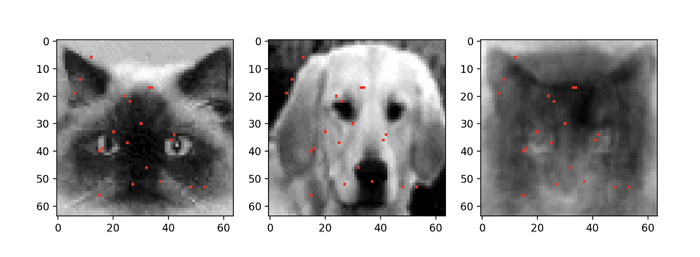

# Sparse Optimization for Classification

This example demonstrates how sparse representation can enable the efficient solution of statistical learning tasks, and produce parsimonious models that are robust to overfitting.  The key concept that underlies this approach is the compressibility of data, which is the foundation of modern compression techniques such as the FFT.  This compressibility is made possible by the fact that high-dimensional data often admits of a low-rank structure when expressed in an appropriate basis, and can therefore be represented compactly.  This also implies that relatively few measurements of the original feature space can often be sufficient for adequate or even excellent performance on classification tasks.  It is this last point that will be demonstrated in this example.

In this example, we will use convex optimization to identify a sparse representation of images that will maximally discriminate between two classes, cats and dogs.  In particular, we will use a small fraction of the original image space to perform a classification task on a small dataset of images with relatively high accuracy.  The idea is to generate a measurement matrix that, when applied to the original data, will produce an extremely sparse representation that contains the pixels with the most discriminatory information.  Below are shown the locations of 20 pixels on a cat, dog, and eigenface image that were used during an iteration of an image classification task in this example.

See the Jupyter notebook for a detailed treatment.

## Getting Started

This example requires the installation of Julia version 1.3 or higher and Jupyter Notebook (if using). Follow the following steps to install the required packages and run the notebook.  Code is also provided as a Julia project in SSPOC/.

1. Build the package, by running from the project directory

`julia -e "using Pkg; Pkg.activate(\"SSPOC\"); Pkg,build();"`

This will install the required packages and create the project-specific Julia kernel for Jupyter (Julia_SSPOC_demo).

2. Open the SSPOC_example.ipynb notebook in Jupyter.  If the notebook is not already configured to use the Julia_SSPOC_demo Jupyter kernel, select the kernel in Kernels -> Change Kernel.

